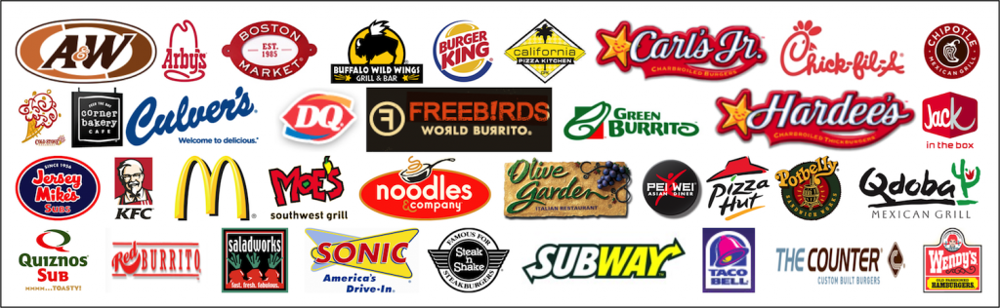

# Insaid Term 1&2 Project - EDA

## Project - Term 1&2: EDA on Fast Food Chains in USA

 

## 1. Problem Statement

A **Fast Food Restaurant**, also known as a **Quick Service Restaurant** (QSR) within the industry, is a specific type of restaurant that serves fast food cuisine and has minimal table service. Arguably, United States is the birthplace of the first fast food restaurant called "White Castle" in 1921. Today, American-founded fast food chains have growns as multinational corporations and having outlets across the globe, However the growth of the fast food restaurant chains within USA is not uniform and shows patterns based on regional preferences.

### 1.1 EDA Objective

Understand the data which is available for **10000 Fast Food Restaurants in USA** by performing an EDA procedure and provide data insights to a person/group to make a decision on investment/s into fast food restaurant business or a franchisee of an existing fast food restaurant brand.

